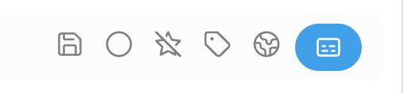

# RSS Dashboard Transcript Helper

An Obsidian helper plugin for extracting transcripts from items opened in `rss-dashboard` reader views.

It currently supports:

- YouTube videos
- TED talks

The plugin is designed to work alongside `rss-dashboard`, but it keeps the transcript logic inside this plugin so reinstalling `rss-dashboard` does not remove transcript support.

## What It Does

When you open a supported item in the RSS Dashboard reader view, this plugin adds a `提取字幕` button near the reader action buttons.

Clicking the button will:

1. Detect the current item type
2. Extract the transcript
3. Generate a Markdown note
4. Save the note into your configured folder
5. Open the saved note in a new tab

## Supported Sources

### YouTube

For YouTube videos, the plugin prefers `yt-dlp` because direct YouTube transcript requests are often blocked or return empty responses in Obsidian/Electron environments.

Current flow:

- Prefer local `yt-dlp`
- Parse downloaded `json3` subtitle files
- Fall back to direct network extraction only if needed

Supported YouTube URL forms include:

- `youtube.com/watch?v=...`
- `youtu.be/...`
- `youtube.com/embed/...`
- `youtube.com/shorts/...`
- `youtube.com/live/...`
- `youtube.com/v/...`

### TED

For TED talks, the plugin extracts transcript data directly from the TED page payload.

Current flow:

- Fetch TED talk page
- Parse `__NEXT_DATA__`
- Read transcript from `pageProps.transcriptData.translation.paragraphs`

## Requirements

### Required

- Obsidian
- `rss-dashboard`

### Strongly Recommended for YouTube

- `yt-dlp`

Without `yt-dlp`, YouTube transcript extraction may fail depending on network conditions and YouTube response behavior.

### Optional but Helpful

- `deno` or `node`

The plugin passes an explicit JavaScript runtime to `yt-dlp` when possible.

## Installation

Copy this plugin folder into:

```text
.obsidian/plugins/rss-dashboard-transcript-helper
```

Then enable it in Obsidian community plugins.

## Settings

### Save folder

The folder used for transcript notes.

Default:

```text
RSS articles
```

## Usage

### Button

Open a supported item in RSS Dashboard reader view, then click `提取字幕`.

The plugin tries to place the button near the built-in reader actions, currently preferring the position after `Open in Browser`.

The blue button in the image below is the transcript download button:



### Command Palette

Available command:

- `提取当前视频字幕并保存`

Despite the command name, the implementation also supports TED items when the current reader item is a TED talk.

## Output Format

The plugin saves transcripts as Markdown notes with frontmatter.

Typical fields:

- `title`
- `date`
- `source`
- `link`
- `guid`
- `mediaType`
- `videoId` for YouTube only

Each transcript line is stored with a timestamp like:

```text
[00:15] Transcript text...
```

## How YouTube Extraction Works

### Primary path

The plugin calls `yt-dlp` with roughly this strategy:

- skip media download
- request subtitles / auto subtitles
- prefer English subtitle variants
- save as `json3`
- parse the downloaded subtitle file

### Runtime detection

The plugin looks for `yt-dlp` in these places:

- `process.env.YT_DLP_PATH`
- `/opt/homebrew/bin/yt-dlp`
- `/usr/local/bin/yt-dlp`
- `/usr/bin/yt-dlp`
- `yt-dlp`

It also tries to locate a JS runtime for `yt-dlp`:

- `process.env.DENO_PATH`
- `/opt/homebrew/bin/deno`
- `/usr/local/bin/deno`
- `process.env.NODE_PATH`
- `process.execPath`
- common Node install paths

### Subtitle language preference

The plugin currently prefers these subtitle variants:

- `en`
- `en-en`
- `en-orig`

It explicitly excludes:

- `en-ar`

This was added to avoid a repeated `429 Too Many Requests` issue on one subtitle variant.

## How TED Extraction Works

The plugin reads transcript paragraphs from TED page data and converts cues into timestamped transcript lines.

It does not depend on `yt-dlp` for TED.

## Known Limitations

- The plugin depends on RSS Dashboard reader internals and DOM structure.
- If `rss-dashboard` changes its reader view implementation significantly, the transcript button injection may need adjustment.
- The command name still says “YouTube” even though TED is supported too.
- The plugin currently prefers English subtitles for YouTube.
- Transcript button placement is DOM-driven and may need retuning if RSS Dashboard changes its action bar markup.

## Troubleshooting

### `spawn yt-dlp ENOENT`

Obsidian cannot find `yt-dlp`.

Check that `yt-dlp` exists in one of the supported paths, or set:

```text
YT_DLP_PATH
```

### `No supported JavaScript runtime could be found`

Install `deno` or `node`, or make sure one of them is visible in a path this plugin checks.

### YouTube transcript extraction fails with rate limits

This usually comes from YouTube subtitle endpoints or aggressive subtitle variant fetching. The plugin already narrows subtitle variants, but YouTube can still rate limit requests.

Retry after a short wait.

### TED transcript not found

TED sometimes changes page payload structure. If this happens again, the extraction path in `fetchTedTranscript()` likely needs updating.

## Development Notes

Main implementation file:

- [`main.js`](./main.js)

Current major responsibilities in code:

- reader view integration
- transcript button injection
- YouTube ID extraction
- YouTube transcript extraction via `yt-dlp`
- TED transcript extraction from page payload
- Markdown note generation

## Suggested Future Improvements

- Rename the command to mention both YouTube and TED
- Add settings for preferred subtitle languages
- Add a configurable `yt-dlp` path in plugin settings
- Add a setting to disable button injection and keep command-only mode
- Add better UI feedback for partial subtitle downloads
